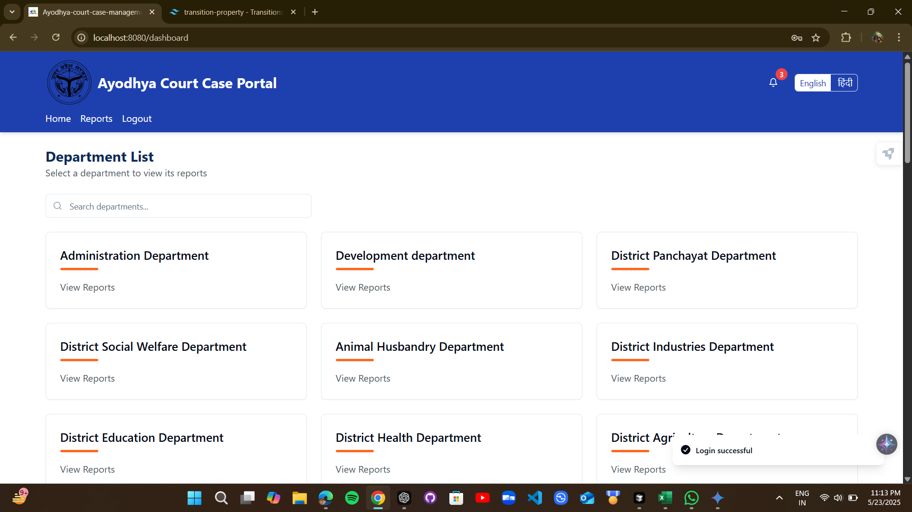
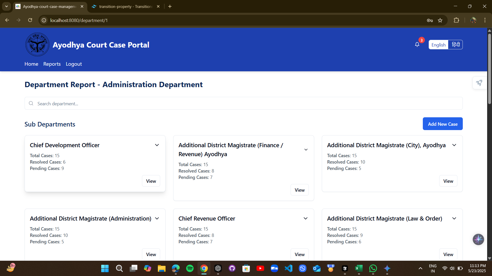
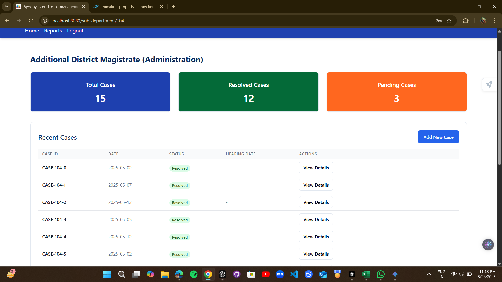
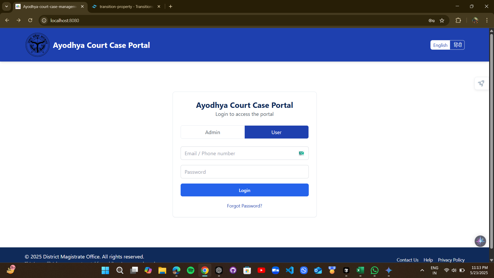

# Ayodhya Court Case Portal

A modern, multi-language portal for managing government department cases, built with React, TypeScript, Vite, shadcn-ui, and Tailwind CSS.

---

## 🚀 Features

- **Department Dashboard:**
  - Browse, search, and filter all departments with a beautiful, responsive UI.
- **Sub-Departments & Case Management:**
  - View sub-departments, recent cases, and detailed case information.
- **Case Actions:**
  - Add new cases
  - Edit case details
  - Send reminders (with email prompt)
  - Multi-language support (English & Hindi)
- **Advanced UI/UX:**
  - Smooth transitions and hover effects
  - Modern cards, dialogs, and tables
  - Toast notifications for user feedback
- **Accessibility & Mobile Ready:**
  - Fully responsive and accessible design.

---

## 🛠️ Tech Stack


- [React](https://react.dev/) + [TypeScript](https://www.typescriptlang.org/)
- [Vite](https://vitejs.dev/)
- [shadcn/ui](https://ui.shadcn.com/)
- [Tailwind CSS](https://tailwindcss.com/)
- [Radix UI](https://www.radix-ui.com/)
- [React Router](https://reactrouter.com/)
- [date-fns](https://date-fns.org/)
- [sonner](https://sonner.emilkowal.ski/)

---

## 📸 Screenshots

### Department List


### Department Report & Sub Departments


### Sub Department - Recent Cases & Stats


### Login Page


> _All UI is fully responsive and supports both English and Hindi!_

---

## 🖥️ Getting Started

### Prerequisites
- Node.js (v18+ recommended)
- npm

### Installation

```sh
# 1. Clone the repository
git clone <YOUR_GIT_URL>
cd jansunwayi-portal-app-71

# 2. Install dependencies
npm install

# 3. Start the development server
npm run dev
```

Visit [http://localhost:5173](http://localhost:5173) to view the app.

### Backend Setup

1. **Navigate to the server directory:**
   ```sh
   cd server
   ```
2. **Install all dependencies from `package.json`:**
   ```sh
   npm install
   ```
3. **Configure your environment:**
   The backend requires environment variables to run. Create a local `.env` file from the example template:
   ```sh
   # On macOS/Linux/Git Bash
   cp .env.example .env

   # On Windows Command Prompt
   copy .env.example .env
   ```
   Now, open the new `.env` file and add your MongoDB connection string.

4. **Start the backend server:**
   ```sh
   node index.js
   ```

The backend will run on port 5000 by default.

---

## 📂 Project Structure

```
jansunwayi_portal_ayodhya/
├── server/         # Backend (Node.js, Express, Mongoose)
├── src/            # Frontend (React, TypeScript)
│   ├── components/
│   ├── pages/
│   ├── contexts/
│   └── lib/
├── public/         # Static assets
└── ...             # Config files (vite, tailwind, etc.)
